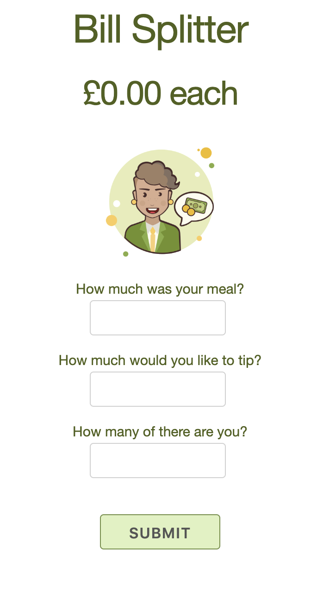
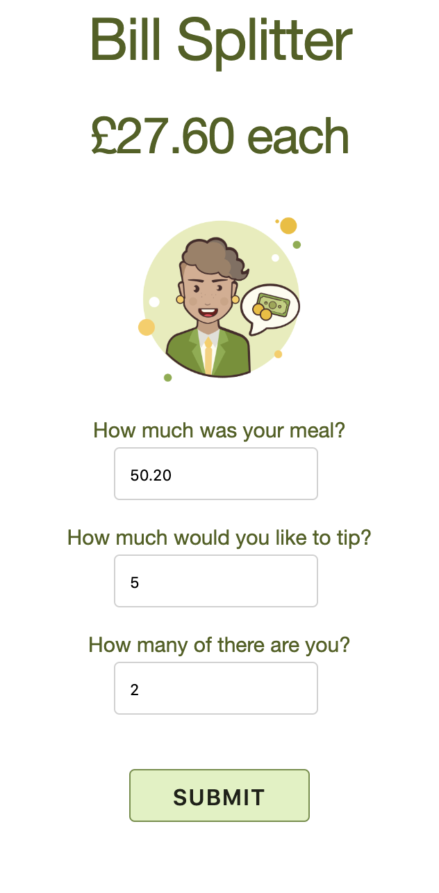

# Split The Bill

I wanted to practice building full stack applications with JavaScript but also wanted to create an application that could be useful for people in the real world. Bill splitting in a restaurant is always a bit of a faff so I created an app that allows you to input the cost of your meal, the tip amount and the number of diners so that you can split the bill equally between you.

## Using this app

This app is deployed on Heroku! :)
Visit it here:

https://splittingthebill.herokuapp.com

## Testing this app

I used Jasmine to test this app. If you'd like to test, please do the following:

1. Clone this repo
2. `cd` into this repo in your terminal
3. Run `open SpecRunner.html` from the command line

## My approach


## Areas for development

* I would like to implement an option whereby a user can choose to tip by percentage rather than a specific amount.

## User Stories

```
As a diner
So that I don't have to spend ages calculating at the end of a meal
I would like to split a dinner bill between my friends and I.

As a diner
So that I can acknowledge good service (and be polite!)
I would like the option of tipping my waiter a percentage of the bill.

As a diner
So that we don't all tip separately and end up tipping too much
I would like the tip to be split between my friends and I also.
```
## Screenshots

<div align="center">
    
</div>

<div align="center">
    
</div>

<div align="center">
    
</div>


## Author / Acknowledgments
Jordan Roberts

Deployed to Heroku following <a href="https://medium.com/@winnieliang/how-to-run-a-simple-html-css-javascript-application-on-heroku-4e664c541b0b">this</a> tutorial, which required making Heroku think that this was a PHP application. This is the reason for the .php file.
